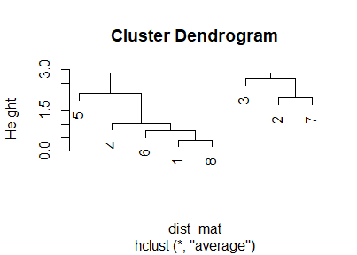
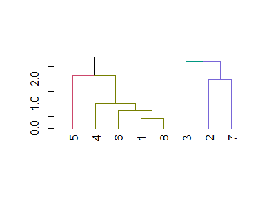
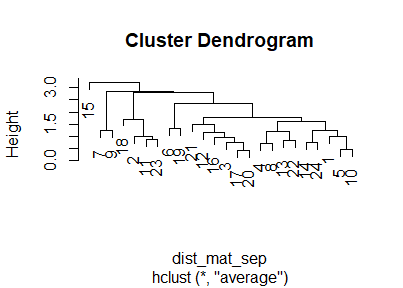
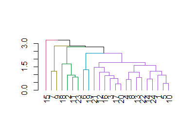

Draft\_3\_NEW\_REPLACEMENT
================
Rossina Soyan
12/2/2021

-   [What I need to load to run the
    codes?](#what-i-need-to-load-to-run-the-codes)
-   [Upload the corpus, create a dataframe with texts and
    names](#upload-the-corpus-create-a-dataframe-with-texts-and-names)
-   [Lexical complexity measures](#lexical-complexity-measures)
    -   [Lexical density](#lexical-density)
    -   [Lexial variation](#lexial-variation)
    -   [Lexical sophistication](#lexical-sophistication)
-   [A dataframe with all the
    findings](#a-dataframe-with-all-the-findings)
-   [An attempt to do the cluster
    analysis](#an-attempt-to-do-the-cluster-analysis)
    -   [Attempt \#1 with 8
        observations](#attempt-1-with-8-observations)
    -   [Attempt \#2](#attempt-2)
-   [Final notes](#final-notes)
    -   [Session info](#session-info)

``` r
##Set knitr options (show both code and output, show output w/o leading #, make figures smaller, hold figures until after chunk)
knitr::opts_chunk$set(echo=TRUE, include=TRUE, comment=NA, fig.height=3, fig.width=4.2, fig.show="hold")
Sys.setlocale("LC_CTYPE", "Russian") #to make sure my text is not gibberish, readable
```

    ## [1] "Russian_Russia.1251"

## What I need to load to run the codes?

``` r
library(tidyverse)
```

    -- Attaching packages --------------------------------------- tidyverse 1.3.1 --

    v ggplot2 3.3.5     v purrr   0.3.4
    v tibble  3.1.4     v dplyr   1.0.7
    v tidyr   1.1.3     v stringr 1.4.0
    v readr   2.0.1     v forcats 0.5.1

    -- Conflicts ------------------------------------------ tidyverse_conflicts() --
    x dplyr::filter() masks stats::filter()
    x dplyr::lag()    masks stats::lag()

``` r
#install.packages('quanteda') to work with a corpus
library(quanteda)
```

    Package version: 3.1.0
    Unicode version: 13.0
    ICU version: 69.1

    Parallel computing: 4 of 4 threads used.

    See https://quanteda.io for tutorials and examples.

``` r
#install.packages("htmlwidgets") to work with strings and regular expressions
library(htmlwidgets)
# install.packages('tidytext') to be able to perform tokenization
library(tidytext)
```

## Upload the corpus, create a dataframe with texts and names

I have decided to upload texts written by only 8 students because I am
running out of time. I have chosen 4 students rated as Intermediate and
4 students rated as Advanced. Each student has submitted 3 texts as part
of their placement examination, it means that the current corpus
consists of 24 texts.

``` r
#How to upload the texts
#From https://www.youtube.com/watch?v=pFinlXYLZ-A
folder <- "C:/Users/Rossina/Documents/CMU_student/3_Fall_2021/Statistics_at_Pitt/data"
filelist_orig <- list.files(path = folder, pattern = ".*.txt")
filelist <- paste(folder, "/", filelist_orig, sep = "")
filelistTexts <- lapply(filelist, FUN = readLines, encoding = "UTF-8", warn = FALSE)
texts <- lapply(filelistTexts, FUN = paste, collapse = " ") %>% 
  str_remove_all("unclear") #I deleted the word "unclear" from the texts
```

Now that I have all the texts uploaded, I want to create a dataframe
with texts and names

``` r
class(texts) #Interesting! It used to show that this is a list, but now the answer is "character"
```

    [1] "character"

``` r
corpus_df <- tibble(text = texts, Student = filelist_orig)
corpus_df #Success
```

    # A tibble: 24 x 2
       text                                                         Student         
       <chr>                                                        <chr>           
     1 "Ìîÿ äîðîãàÿ!  òâî¸ì ïîñëåäíåì ïèñüìå, òû ñïðîñèëà ìíå î ì~ Student1_Entry1~
     2 "Ðåáÿòà!  ìî¸ì ãîðîäå ïîÿâèëàñü íîâàÿ ïðîáëåìà - íàøà âîäà~ Student1_Entry2~
     3 "Îäíàæäû, ñèäÿ ñ îòöîì íà ìåçîíèíå, îí íà÷àë êðèòèêîâàòü ìî~ Student1_Entry3~
     4 "Äîðîãîé Æåíÿ, Êàê òû? Õîòåëà ðàçãîâàðèâàòü ñ òîáîé î íàøåé~ Student2_Entry1~
     5 "Ïðèâåò âñåì. Íàäåþñü, ÷òî âñ¸ õîðîøî ñ âàìè. Ðàíüøå, ñåãîä~ Student2_Entry2~
     6 " íàøåì âðåìÿ, ó íàñ åñòü ìíîãèå âàðèàíòû, õî÷åòñÿ ëè íàì ~ Student2_Entry3~
     7 "Äîðîãàÿ Èðèíà! Ñïàñèáî çà âàøå ïèñüìî. Êîíå÷íî, ìîé ëó÷øèé~ Student3_Entry1~
     8 "Ó íàñ â ãîðîäå Í.  åñòü îãðîìíàÿ ïðîáëåìà - â ñëîâîì, ó íà~ Student3_Entry2~
     9 "Ãîâîðÿò, ÷òî  äåòè  íàøåãî âðåìåíè íå óìåþò ðàçãîâàðèâàòü ~ Student3_Entry3~
    10 "Ñåãîäíÿ ÿ õî÷ó ñêàçàòü î ñâîåé ñàìîé  áëèçêîé ïîäðóãîé. Ÿ~ Student4_Entry1~
    # ... with 14 more rows

I need to separate student ids and student texts

``` r
corpus_df2 <- corpus_df %>% 
  separate(Student, c("Student", "Entry"))
```

    Warning: Expected 2 pieces. Additional pieces discarded in 24 rows [1, 2, 3, 4,
    5, 6, 7, 8, 9, 10, 11, 12, 13, 14, 15, 16, 17, 18, 19, 20, ...].

``` r
corpus_df2
```

    # A tibble: 24 x 3
       text                                                           Student  Entry
       <chr>                                                          <chr>    <chr>
     1 "Ìîÿ äîðîãàÿ!  òâî¸ì ïîñëåäíåì ïèñüìå, òû ñïðîñèëà ìíå î ìî¸~ Student1 Entr~
     2 "Ðåáÿòà!  ìî¸ì ãîðîäå ïîÿâèëàñü íîâàÿ ïðîáëåìà - íàøà âîäà ñ~ Student1 Entr~
     3 "Îäíàæäû, ñèäÿ ñ îòöîì íà ìåçîíèíå, îí íà÷àë êðèòèêîâàòü ìîåã~ Student1 Entr~
     4 "Äîðîãîé Æåíÿ, Êàê òû? Õîòåëà ðàçãîâàðèâàòü ñ òîáîé î íàøåé ï~ Student2 Entr~
     5 "Ïðèâåò âñåì. Íàäåþñü, ÷òî âñ¸ õîðîøî ñ âàìè. Ðàíüøå, ñåãîäíÿ~ Student2 Entr~
     6 " íàøåì âðåìÿ, ó íàñ åñòü ìíîãèå âàðèàíòû, õî÷åòñÿ ëè íàì ãî~ Student2 Entr~
     7 "Äîðîãàÿ Èðèíà! Ñïàñèáî çà âàøå ïèñüìî. Êîíå÷íî, ìîé ëó÷øèé ä~ Student3 Entr~
     8 "Ó íàñ â ãîðîäå Í.  åñòü îãðîìíàÿ ïðîáëåìà - â ñëîâîì, ó íàñ ~ Student3 Entr~
     9 "Ãîâîðÿò, ÷òî  äåòè  íàøåãî âðåìåíè íå óìåþò ðàçãîâàðèâàòü äð~ Student3 Entr~
    10 "Ñåãîäíÿ ÿ õî÷ó ñêàçàòü î ñâîåé ñàìîé  áëèçêîé ïîäðóãîé. Ÿ ç~ Student4 Entr~
    # ... with 14 more rows

I need to add their proficiency ratings

``` r
#I am using something I saw in Winter's textbook + https://rstudio-pubs-static.s3.amazonaws.com/116317_e6922e81e72e4e3f83995485ce686c14.html#/9
corpus_df3 <- mutate(corpus_df2, Proficiency = ifelse(grepl("[1-4]", Student), "Intermediate", "Advanced"))
head(corpus_df3) #Success!
```

    # A tibble: 6 x 4
      text                                                Student  Entry Proficiency
      <chr>                                               <chr>    <chr> <chr>      
    1 "Ìîÿ äîðîãàÿ!  òâî¸ì ïîñëåäíåì ïèñüìå, òû ñïðîñèë~ Student1 Entr~ Intermedia~
    2 "Ðåáÿòà!  ìî¸ì ãîðîäå ïîÿâèëàñü íîâàÿ ïðîáëåìà - ~ Student1 Entr~ Intermedia~
    3 "Îäíàæäû, ñèäÿ ñ îòöîì íà ìåçîíèíå, îí íà÷àë êðèòè~ Student1 Entr~ Intermedia~
    4 "Äîðîãîé Æåíÿ, Êàê òû? Õîòåëà ðàçãîâàðèâàòü ñ òîáî~ Student2 Entr~ Intermedia~
    5 "Ïðèâåò âñåì. Íàäåþñü, ÷òî âñ¸ õîðîøî ñ âàìè. Ðàíü~ Student2 Entr~ Intermedia~
    6 " íàøåì âðåìÿ, ó íàñ åñòü ìíîãèå âàðèàíòû, õî÷åòñ~ Student2 Entr~ Intermedia~

I need to tokenize my texts

``` r
corpus_df_tidy <- corpus_df3 %>% 
  mutate(text = gsub(x = text, pattern = "\\-\\s", replacement = "")) %>% #to make sure there are no lonely dashes as token
  unnest_tokens(word, text, token = "regex", pattern = "[\\s,\\.\\?!\\(\\)\\:\";]") #let me check if words look like real words in all these 8 texts
corpus_df_tidy %>% 
  filter(str_detect(word, "-")) #Success! 60 words have been identified as 1 word, not two. That's great!
```

    # A tibble: 60 x 4
       Student  Entry  Proficiency  word     
       <chr>    <chr>  <chr>        <chr>    
     1 Student1 Entry1 Intermediate èç-çà    
     2 Student1 Entry2 Intermediate âî-ïåðâûõ
     3 Student1 Entry2 Intermediate ÷òî-òî   
     4 Student1 Entry2 Intermediate èç-çà    
     5 Student1 Entry2 Intermediate ý-ìàéë   
     6 Student1 Entry2 Intermediate âî-ïåðâûõ
     7 Student1 Entry2 Intermediate âî-âòîðûõ
     8 Student1 Entry2 Intermediate â-òðåòüèõ
     9 Student1 Entry3 Intermediate ïî-ìîåìó 
    10 Student1 Entry3 Intermediate èç-çà    
    # ... with 50 more rows

## Lexical complexity measures

### Lexical density

These files are the lists of non-lexical words that I have created

``` r
RusConjCoord2 <- readLines("additional_documents/Russian_conjunctions_COORD.txt", encoding = "UTF-8", warn = FALSE) %>% 
  str_remove_all("<.+>") 
RusPrep2 <- readLines("additional_documents/Russian_prepositions.txt", encoding = "UTF-8", warn = FALSE) %>% 
  str_remove_all("<.+>") 
RusConjSubord2 <- readLines("additional_documents/Russian_conjunctions_SUBORD.txt", encoding = "UTF-8", warn = FALSE) %>% 
  str_remove_all("<.+>")
RusInter2 <- readLines("additional_documents/Russian_interjections.txt", encoding = "UTF-8", warn = FALSE) %>%
  str_remove_all("<.+>")
RusPrtcl2 <- readLines("additional_documents/Russian_particles.txt", encoding = "UTF-8", warn = FALSE) %>% 
  str_remove_all("<.+>") 
AllnonLEX <- c(RusConjCoord2, RusPrep2, RusConjSubord2, RusInter2, RusPrtcl2) 
AllnonLEX_df <- tibble(word = AllnonLEX) #This column name should be the same for using the anti-join()
head(AllnonLEX_df) #Success! 
```

    # A tibble: 6 x 1
      word       
      <chr>      
    1 ""         
    2 "è"        
    3 "äà"       
    4 "íå òîëüêî"
    5 "íî è"     
    6 "òàêæå"    

And now I need to calculate lexical density

``` r
df_LexDens_sep <-corpus_df_tidy %>% 
  group_by(Student, Entry) %>% 
  summarize(total_words = n(),
         lexical_words = sum(!word %in% AllnonLEX_df$word),
         lexical_density = lexical_words/total_words)
```

    `summarise()` has grouped output by 'Student'. You can override using the `.groups` argument.

``` r
df_LexDens_sep
```

    # A tibble: 24 x 5
    # Groups:   Student [8]
       Student  Entry  total_words lexical_words lexical_density
       <chr>    <chr>        <int>         <int>           <dbl>
     1 Student1 Entry1         316           229           0.725
     2 Student1 Entry2         278           219           0.788
     3 Student1 Entry3         282           212           0.752
     4 Student2 Entry1         216           159           0.736
     5 Student2 Entry2         145           108           0.745
     6 Student2 Entry3          92            65           0.707
     7 Student3 Entry1         126           102           0.810
     8 Student3 Entry2         110            83           0.755
     9 Student3 Entry3          57            46           0.807
    10 Student4 Entry1         231           175           0.758
    # ... with 14 more rows

Manual check

``` r
316+278+282 #matches
```

    [1] 876

``` r
(0.7246835 + 0.7877698 + 0.7517730)/3  #  Good enough
```

    [1] 0.7547421

I want to compare the averaged numbers

``` r
df_LexDens_tog <-corpus_df_tidy %>% 
  group_by(Student) %>% 
  summarize(total_words = n(),
         lexical_words = sum(!word %in% AllnonLEX_df$word),
         lexical_density = lexical_words/total_words)

df_LexDens_tog
```

    # A tibble: 8 x 4
      Student  total_words lexical_words lexical_density
      <chr>          <int>         <int>           <dbl>
    1 Student1         876           660           0.753
    2 Student2         453           332           0.733
    3 Student3         293           231           0.788
    4 Student4         479           363           0.758
    5 Student5         642           455           0.709
    6 Student6         606           451           0.744
    7 Student7         676           496           0.734
    8 Student8         829           617           0.744

### Lexial variation

Lexial variation is measured with type-token ratio but since TTR is
affected by text length, researchers started using MTLD instead.

``` r
#I googled MTLD function in the koRpus package. Let's try it out.
#install.packages("koRpus")
#install.koRpus.lang(c("en","ru"))
#available.koRpus.lang()
library(koRpus) #I hope this package helps me calculate MTLD
```

    Loading required package: sylly

    For information on available language packages for 'koRpus', run

      available.koRpus.lang()

    and see ?install.koRpus.lang()


    Attaching package: 'koRpus'

    The following objects are masked from 'package:quanteda':

        tokens, types

    The following object is masked from 'package:readr':

        tokenize

``` r
library(koRpus.lang.ru)
library(koRpus.lang.en)
#I am expected to tokenize the text within the tokenize function of this package

#My failed attempd to calculate MTLD for all entries and students in one fell swoop. The results is gibberish
Tokens_for_MTLD <- lapply(filelist, FUN = tokenize, fileEncoding = "UTF-8", lang = "ru") 
#I still don't know how to filter out the word "unclear"
lapply(Tokens_for_MTLD, FUN = MTLD) #Success. The MTLD for S1_E1 is 175.36. Let's check manually
```

    Language: "ru"
    Language: "ru"
    Language: "ru"
    Language: "ru"
    Language: "ru"
    Language: "ru"

    Warning: Text is relatively short (<100 tokens), results are probably not
    reliable!

    Language: "ru"
    Language: "ru"
    Language: "ru"

    Warning: Text is relatively short (<100 tokens), results are probably not
    reliable!

    Language: "ru"
    Language: "ru"
    Language: "ru"
    Language: "ru"
    Language: "ru"
    Language: "ru"

    Warning: Text is relatively short (<100 tokens), results are probably not
    reliable!

    Language: "ru"
    Language: "ru"
    Language: "ru"
    Language: "ru"
    Language: "ru"
    Language: "ru"
    Language: "ru"
    Language: "ru"
    Language: "ru"

    [[1]]

    Total number of tokens: 320 
    Total number of types:  204

    Measure of Textual Lexical Diversity
                  MTLD: 175.36 
     Number of factors: NA 
           Factor size: 0.72 
      SD tokens/factor: 59.12 (all factors) 
                        70.71 (complete factors only)


    Note: Analysis was conducted case insensitive.


    [[2]]

    Total number of tokens: 284 
    Total number of types:  195

    Measure of Textual Lexical Diversity
                  MTLD: 210.55 
     Number of factors: NA 
           Factor size: 0.72 
      SD tokens/factor: 66.7 (all factors) 
                        7.78 (complete factors only)


    Note: Analysis was conducted case insensitive.


    [[3]]

    Total number of tokens: 286 
    Total number of types:  169

    Measure of Textual Lexical Diversity
                  MTLD: 98.27 
     Number of factors: NA 
           Factor size: 0.72 
      SD tokens/factor: 56.36 (all factors) 
                        59.42 (complete factors only)


    Note: Analysis was conducted case insensitive.


    [[4]]

    Total number of tokens: 223 
    Total number of types:  147

    Measure of Textual Lexical Diversity
                  MTLD: 152.57 
     Number of factors: NA 
           Factor size: 0.72 
      SD tokens/factor: 47.28 (all factors) 
                        27.58 (complete factors only)


    Note: Analysis was conducted case insensitive.


    [[5]]

    Total number of tokens: 147 
    Total number of types:  116

    Measure of Textual Lexical Diversity
                  MTLD: 195.18 
     Number of factors: NA 
           Factor size: 0.72 
      SD tokens/factor: 0 (all factors) 
                        0 (complete factors only)


    Note: Analysis was conducted case insensitive.


    [[6]]

    Total number of tokens: 97 
    Total number of types:  63

    Measure of Textual Lexical Diversity
                  MTLD: 65.09 
     Number of factors: NA 
           Factor size: 0.72 
      SD tokens/factor: 11.03 (all factors) 
                        1.41 (complete factors only)


    Note: Analysis was conducted case insensitive.


    [[7]]

    Total number of tokens: 127 
    Total number of types:  90

    Measure of Textual Lexical Diversity
                  MTLD: 103.33 
     Number of factors: NA 
           Factor size: 0.72 
      SD tokens/factor: 46.64 (all factors) 
                        14.85 (complete factors only)


    Note: Analysis was conducted case insensitive.


    [[8]]

    Total number of tokens: 112 
    Total number of types:  86

    Measure of Textual Lexical Diversity
                  MTLD: 135.09 
     Number of factors: NA 
           Factor size: 0.72 
      SD tokens/factor: 0 (all factors) 
                        0 (complete factors only)


    Note: Analysis was conducted case insensitive.


    [[9]]

    Total number of tokens: 62 
    Total number of types:  52

    Measure of Textual Lexical Diversity
                  MTLD: 107.63 
     Number of factors: NA 
           Factor size: 0.72 
      SD tokens/factor: 0 (all factors) 
                        0 (complete factors only)


    Note: Analysis was conducted case insensitive.


    [[10]]

    Total number of tokens: 236 
    Total number of types:  162

    Measure of Textual Lexical Diversity
                  MTLD: 195.88 
     Number of factors: NA 
           Factor size: 0.72 
      SD tokens/factor: 81.64 (all factors) 
                        60.1 (complete factors only)


    Note: Analysis was conducted case insensitive.


    [[11]]

    Total number of tokens: 136 
    Total number of types:  112

    Measure of Textual Lexical Diversity
                  MTLD: 215.79 
     Number of factors: NA 
           Factor size: 0.72 
      SD tokens/factor: 0 (all factors) 
                        0 (complete factors only)


    Note: Analysis was conducted case insensitive.


    [[12]]

    Total number of tokens: 120 
    Total number of types:  88

    Measure of Textual Lexical Diversity
                  MTLD: 126 
     Number of factors: NA 
           Factor size: 0.72 
      SD tokens/factor: 0 (all factors) 
                        0 (complete factors only)


    Note: Analysis was conducted case insensitive.


    [[13]]

    Total number of tokens: 391 
    Total number of types:  233

    Measure of Textual Lexical Diversity
                  MTLD: 130.99 
     Number of factors: NA 
           Factor size: 0.72 
      SD tokens/factor: 69.05 (all factors) 
                        74.79 (complete factors only)


    Note: Analysis was conducted case insensitive.


    [[14]]

    Total number of tokens: 156 
    Total number of types:  120

    Measure of Textual Lexical Diversity
                  MTLD: 189.28 
     Number of factors: NA 
           Factor size: 0.72 
      SD tokens/factor: 0 (all factors) 
                        0 (complete factors only)


    Note: Analysis was conducted case insensitive.


    [[15]]

    Total number of tokens: 99 
    Total number of types:  75

    Measure of Textual Lexical Diversity
                  MTLD: 114.34 
     Number of factors: NA 
           Factor size: 0.72 
      SD tokens/factor: 0 (all factors) 
                        0 (complete factors only)


    Note: Analysis was conducted case insensitive.


    [[16]]

    Total number of tokens: 229 
    Total number of types:  158

    Measure of Textual Lexical Diversity
                  MTLD: 132.16 
     Number of factors: NA 
           Factor size: 0.72 
      SD tokens/factor: 70.15 (all factors) 
                        83.44 (complete factors only)


    Note: Analysis was conducted case insensitive.


    [[17]]

    Total number of tokens: 190 
    Total number of types:  125

    Measure of Textual Lexical Diversity
                  MTLD: 110.72 
     Number of factors: NA 
           Factor size: 0.72 
      SD tokens/factor: 35.81 (all factors) 
                        15.56 (complete factors only)


    Note: Analysis was conducted case insensitive.


    [[18]]

    Total number of tokens: 212 
    Total number of types:  152

    Measure of Textual Lexical Diversity
                  MTLD: 212 
     Number of factors: NA 
           Factor size: 0.72 
      SD tokens/factor: 112.01 (all factors) 
                        0 (complete factors only)


    Note: Analysis was conducted case insensitive.


    [[19]]

    Total number of tokens: 284 
    Total number of types:  164

    Measure of Textual Lexical Diversity
                  MTLD: 85.26 
     Number of factors: NA 
           Factor size: 0.72 
      SD tokens/factor: 34.8 (all factors) 
                        28.91 (complete factors only)


    Note: Analysis was conducted case insensitive.


    [[20]]

    Total number of tokens: 202 
    Total number of types:  132

    Measure of Textual Lexical Diversity
                  MTLD: 116.43 
     Number of factors: NA 
           Factor size: 0.72 
      SD tokens/factor: 41.12 (all factors) 
                        39.6 (complete factors only)


    Note: Analysis was conducted case insensitive.


    [[21]]

    Total number of tokens: 197 
    Total number of types:  128

    Measure of Textual Lexical Diversity
                  MTLD: 92.46 
     Number of factors: NA 
           Factor size: 0.72 
      SD tokens/factor: 26.07 (all factors) 
                        30.89 (complete factors only)


    Note: Analysis was conducted case insensitive.


    [[22]]

    Total number of tokens: 317 
    Total number of types:  200

    Measure of Textual Lexical Diversity
                  MTLD: 138.16 
     Number of factors: NA 
           Factor size: 0.72 
      SD tokens/factor: 51.76 (all factors) 
                        14.5 (complete factors only)


    Note: Analysis was conducted case insensitive.


    [[23]]

    Total number of tokens: 294 
    Total number of types:  202

    Measure of Textual Lexical Diversity
                  MTLD: 185.48 
     Number of factors: NA 
           Factor size: 0.72 
      SD tokens/factor: 72.47 (all factors) 
                        17.68 (complete factors only)


    Note: Analysis was conducted case insensitive.


    [[24]]

    Total number of tokens: 226 
    Total number of types:  160

    Measure of Textual Lexical Diversity
                  MTLD: 157.07 
     Number of factors: NA 
           Factor size: 0.72 
      SD tokens/factor: 89.34 (all factors) 
                        106.07 (complete factors only)


    Note: Analysis was conducted case insensitive.

``` r
#I am checking the MTLD manually
S1_E1 <- tokenize("C:/Users/Rossina/Documents/CMU_student/3_Fall_2021/Statistics_at_Pitt/data/Student1_Entry1.txt", fileEncoding = "UTF-8", lang = "ru")  #Success. 
#I tried using filter to remove "unclear" and str_remove_all - it didn't work out. I cannot even find out if there are words "unclear" in the text
#S1_E1 %>% 
#  filter(str_detect(token, "unclear"))
MTLD(S1_E1) #Success! The number matches the number from above - 175.36
```

    Language: "ru"


    Total number of tokens: 320 
    Total number of types:  204

    Measure of Textual Lexical Diversity
                  MTLD: 175.36 
     Number of factors: NA 
           Factor size: 0.72 
      SD tokens/factor: 59.12 (all factors) 
                        70.71 (complete factors only)


    Note: Analysis was conducted case insensitive.

``` r
#I am not sure how to put the results into a tibble but NOT manually. The results look like this
#Language: "ru"

#Total number of tokens: 320 
#Total number of types:  204

#Measure of Textual Lexical Diversity
 #             MTLD: 175.36 
 #Number of factors: NA 
  #     Factor size: 0.72 
  #SD tokens/factor: 59.12 (all factors) 
   #                 70.71 (complete factors only)

#Note: Analysis was conducted case insensitive.

filelist %>% 
  map(tokenize, fileEncoding = "UTF-8", lang = "ru") %>% 
  map(MTLD) %>% 
  map(attr, "MTLD") #it still spits out a lot of numbers. For now, I will just a vector manually, and I will think about figuring out the automatization later on.
```

    Language: "ru"
    Language: "ru"
    Language: "ru"
    Language: "ru"
    Language: "ru"
    Language: "ru"

    Warning: Text is relatively short (<100 tokens), results are probably not
    reliable!

    Language: "ru"
    Language: "ru"
    Language: "ru"

    Warning: Text is relatively short (<100 tokens), results are probably not
    reliable!

    Language: "ru"
    Language: "ru"
    Language: "ru"
    Language: "ru"
    Language: "ru"
    Language: "ru"

    Warning: Text is relatively short (<100 tokens), results are probably not
    reliable!

    Language: "ru"
    Language: "ru"
    Language: "ru"
    Language: "ru"
    Language: "ru"
    Language: "ru"
    Language: "ru"
    Language: "ru"
    Language: "ru"

    [[1]]
    [[1]]$MTLD
    [1] 175.3629

    [[1]]$all.forw
    [1] NA

    [[1]]$all.back
    [1] NA

    [[1]]$factors
        forw     back 
    1.897344 1.757576 

    [[1]]$lengths
    [[1]]$lengths$forw
    [1] 121 199

    [[1]]$lengths$forw.compl
    [1] 121

    [[1]]$lengths$mean
    [1] 160

    [[1]]$lengths$mean.compl
    [1] 171

    [[1]]$lengths$sd
    [1] 59.11571

    [[1]]$lengths$sd.compl
    [1] 70.71068

    [[1]]$lengths$back
    [1] 221  99

    [[1]]$lengths$back.compl
    [1] 221


    [[2]]
    [[2]]$MTLD
    [1] 210.5521

    [[2]]$all.forw
    [1] NA

    [[2]]$all.back
    [1] NA

    [[2]]$factors
        forw     back 
    1.436508 1.271248 

    [[2]]$lengths
    [[2]]$lengths$forw
    [1] 194  90

    [[2]]$lengths$forw.compl
    [1] 194

    [[2]]$lengths$mean
    [1] 142

    [[2]]$lengths$mean.compl
    [1] 199.5

    [[2]]$lengths$sd
    [1] 66.69833

    [[2]]$lengths$sd.compl
    [1] 7.778175

    [[2]]$lengths$back
    [1] 205  79

    [[2]]$lengths$back.compl
    [1] 205


    [[3]]
    [[3]]$MTLD
    [1] 98.27186

    [[3]]$all.forw
    [1] NA

    [[3]]$all.back
    [1] NA

    [[3]]$factors
        forw     back 
    2.420168 3.649351 

    [[3]]$lengths
    [[3]]$lengths$forw
    [1] 174  95  17

    [[3]]$lengths$forw.compl
    [1] 174  95

    [[3]]$lengths$mean
    [1] 81.71429

    [[3]]$lengths$mean.compl
    [1] 91.2

    [[3]]$lengths$sd
    [1] 56.36404

    [[3]]$lengths$sd.compl
    [1] 59.4239

    [[3]]$lengths$back
    [1]  7 99 81 99

    [[3]]$lengths$back.compl
    [1]  7 99 81


    [[4]]
    [[4]]$MTLD
    [1] 152.5668

    [[4]]$all.forw
    [1] NA

    [[4]]$all.back
    [1] NA

    [[4]]$factors
        forw     back 
    1.639098 1.318878 

    [[4]]$lengths
    [[4]]$lengths$forw
    [1] 128  95

    [[4]]$lengths$forw.compl
    [1] 128

    [[4]]$lengths$mean
    [1] 111.5

    [[4]]$lengths$mean.compl
    [1] 147.5

    [[4]]$lengths$sd
    [1] 47.27579

    [[4]]$lengths$sd.compl
    [1] 27.57716

    [[4]]$lengths$back
    [1] 167  56

    [[4]]$lengths$back.compl
    [1] 167


    [[5]]
    [[5]]$MTLD
    [1] 195.1781

    [[5]]$all.forw
    [1] NA

    [[5]]$all.back
    [1] NA

    [[5]]$factors
         forw      back 
    0.7531584 0.7531584 

    [[5]]$lengths
    [[5]]$lengths$forw
    [1] 147

    [[5]]$lengths$forw.compl
    [1] 0

    [[5]]$lengths$mean
    [1] 147

    [[5]]$lengths$mean.compl
    [1] 0

    [[5]]$lengths$sd
    [1] 0

    [[5]]$lengths$sd.compl
    [1] 0

    [[5]]$lengths$back
    [1] 147

    [[5]]$lengths$back.compl
    [1] 0


    [[6]]
    [[6]]$MTLD
    [1] 65.09479

    [[6]]$all.forw
    [1] NA

    [[6]]$all.back
    [1] NA

    [[6]]$factors
       forw    back 
    1.37594 1.62500 

    [[6]]$lengths
    [[6]]$lengths$forw
    [1] 59 38

    [[6]]$lengths$forw.compl
    [1] 59

    [[6]]$lengths$mean
    [1] 48.5

    [[6]]$lengths$mean.compl
    [1] 58

    [[6]]$lengths$sd
    [1] 11.03026

    [[6]]$lengths$sd.compl
    [1] 1.414214

    [[6]]$lengths$back
    [1] 57 40

    [[6]]$lengths$back.compl
    [1] 57


    [[7]]
    [[7]]$MTLD
    [1] 103.3308

    [[7]]$all.forw
    [1] NA

    [[7]]$all.back
    [1] NA

    [[7]]$factors
        forw     back 
    1.255102 1.204082 

    [[7]]$lengths
    [[7]]$lengths$forw
    [1] 113  14

    [[7]]$lengths$forw.compl
    [1] 113

    [[7]]$lengths$mean
    [1] 63.5

    [[7]]$lengths$mean.compl
    [1] 102.5

    [[7]]$lengths$sd
    [1] 46.6369

    [[7]]$lengths$sd.compl
    [1] 14.84924

    [[7]]$lengths$back
    [1] 92 35

    [[7]]$lengths$back.compl
    [1] 92


    [[8]]
    [[8]]$MTLD
    [1] 135.0892

    [[8]]$all.forw
    [1] NA

    [[8]]$all.back
    [1] NA

    [[8]]$factors
         forw      back 
    0.8290816 0.8290816 

    [[8]]$lengths
    [[8]]$lengths$forw
    [1] 112

    [[8]]$lengths$forw.compl
    [1] 0

    [[8]]$lengths$mean
    [1] 112

    [[8]]$lengths$mean.compl
    [1] 0

    [[8]]$lengths$sd
    [1] 0

    [[8]]$lengths$sd.compl
    [1] 0

    [[8]]$lengths$back
    [1] 112

    [[8]]$lengths$back.compl
    [1] 0


    [[9]]
    [[9]]$MTLD
    [1] 107.632

    [[9]]$all.forw
    [1] NA

    [[9]]$all.back
    [1] NA

    [[9]]$factors
         forw      back 
    0.5760369 0.5760369 

    [[9]]$lengths
    [[9]]$lengths$forw
    [1] 62

    [[9]]$lengths$forw.compl
    [1] 0

    [[9]]$lengths$mean
    [1] 62

    [[9]]$lengths$mean.compl
    [1] 0

    [[9]]$lengths$sd
    [1] 0

    [[9]]$lengths$sd.compl
    [1] 0

    [[9]]$lengths$back
    [1] 62

    [[9]]$lengths$back.compl
    [1] 0


    [[10]]
    [[10]]$MTLD
    [1] 195.8821

    [[10]]$all.forw
    [1] NA

    [[10]]$all.back
    [1] NA

    [[10]]$factors
       forw    back 
    1.51511 1.00000 

    [[10]]$lengths
    [[10]]$lengths$forw
    [1] 132 104

    [[10]]$lengths$forw.compl
    [1] 132

    [[10]]$lengths$mean
    [1] 118

    [[10]]$lengths$mean.compl
    [1] 174.5

    [[10]]$lengths$sd
    [1] 81.63741

    [[10]]$lengths$sd.compl
    [1] 60.10408

    [[10]]$lengths$back
    [1] 217  19

    [[10]]$lengths$back.compl
    [1] 217


    [[11]]
    [[11]]$MTLD
    [1] 215.7867

    [[11]]$all.forw
    [1] NA

    [[11]]$all.back
    [1] NA

    [[11]]$factors
         forw      back 
    0.6302521 0.6302521 

    [[11]]$lengths
    [[11]]$lengths$forw
    [1] 136

    [[11]]$lengths$forw.compl
    [1] 0

    [[11]]$lengths$mean
    [1] 136

    [[11]]$lengths$mean.compl
    [1] 0

    [[11]]$lengths$sd
    [1] 0

    [[11]]$lengths$sd.compl
    [1] 0

    [[11]]$lengths$back
    [1] 136

    [[11]]$lengths$back.compl
    [1] 0


    [[12]]
    [[12]]$MTLD
    [1] 126

    [[12]]$all.forw
    [1] NA

    [[12]]$all.back
    [1] NA

    [[12]]$factors
        forw     back 
    0.952381 0.952381 

    [[12]]$lengths
    [[12]]$lengths$forw
    [1] 120

    [[12]]$lengths$forw.compl
    [1] 0

    [[12]]$lengths$mean
    [1] 120

    [[12]]$lengths$mean.compl
    [1] 0

    [[12]]$lengths$sd
    [1] 0

    [[12]]$lengths$sd.compl
    [1] 0

    [[12]]$lengths$back
    [1] 120

    [[12]]$lengths$back.compl
    [1] 0


    [[13]]
    [[13]]$MTLD
    [1] 130.9855

    [[13]]$all.forw
    [1] NA

    [[13]]$all.back
    [1] NA

    [[13]]$factors
        forw     back 
    3.303951 2.722311 

    [[13]]$lengths
    [[13]]$lengths$forw
    [1] 132 206   6  47

    [[13]]$lengths$forw.compl
    [1] 132 206   6

    [[13]]$lengths$mean
    [1] 111.7143

    [[13]]$lengths$mean.compl
    [1] 129.2

    [[13]]$lengths$sd
    [1] 69.0476

    [[13]]$lengths$sd.compl
    [1] 74.7877

    [[13]]$lengths$back
    [1] 164 138  89

    [[13]]$lengths$back.compl
    [1] 164 138


    [[14]]
    [[14]]$MTLD
    [1] 189.28

    [[14]]$all.forw
    [1] NA

    [[14]]$all.back
    [1] NA

    [[14]]$factors
         forw      back 
    0.8241758 0.8241758 

    [[14]]$lengths
    [[14]]$lengths$forw
    [1] 156

    [[14]]$lengths$forw.compl
    [1] 0

    [[14]]$lengths$mean
    [1] 156

    [[14]]$lengths$mean.compl
    [1] 0

    [[14]]$lengths$sd
    [1] 0

    [[14]]$lengths$sd.compl
    [1] 0

    [[14]]$lengths$back
    [1] 156

    [[14]]$lengths$back.compl
    [1] 0


    [[15]]
    [[15]]$MTLD
    [1] 114.345

    [[15]]$all.forw
    [1] NA

    [[15]]$all.back
    [1] NA

    [[15]]$factors
         forw      back 
    0.8658009 0.8658009 

    [[15]]$lengths
    [[15]]$lengths$forw
    [1] 99

    [[15]]$lengths$forw.compl
    [1] 0

    [[15]]$lengths$mean
    [1] 99

    [[15]]$lengths$mean.compl
    [1] 0

    [[15]]$lengths$sd
    [1] 0

    [[15]]$lengths$sd.compl
    [1] 0

    [[15]]$lengths$back
    [1] 99

    [[15]]$lengths$back.compl
    [1] 0


    [[16]]
    [[16]]$MTLD
    [1] 132.1626

    [[16]]$all.forw
    [1] NA

    [[16]]$all.back
    [1] NA

    [[16]]$factors
        forw     back 
    1.609756 1.876011 

    [[16]]$lengths
    [[16]]$lengths$forw
    [1] 188  41

    [[16]]$lengths$forw.compl
    [1] 188

    [[16]]$lengths$mean
    [1] 114.5

    [[16]]$lengths$mean.compl
    [1] 129

    [[16]]$lengths$sd
    [1] 70.15459

    [[16]]$lengths$sd.compl
    [1] 83.4386

    [[16]]$lengths$back
    [1]  70 159

    [[16]]$lengths$back.compl
    [1] 70


    [[17]]
    [[17]]$MTLD
    [1] 110.7156

    [[17]]$all.forw
    [1] NA

    [[17]]$all.back
    [1] NA

    [[17]]$factors
        forw     back 
    1.788497 1.649351 

    [[17]]$lengths
    [[17]]$lengths$forw
    [1] 113  77

    [[17]]$lengths$forw.compl
    [1] 113

    [[17]]$lengths$mean
    [1] 95

    [[17]]$lengths$mean.compl
    [1] 124

    [[17]]$lengths$sd
    [1] 35.81434

    [[17]]$lengths$sd.compl
    [1] 15.55635

    [[17]]$lengths$back
    [1] 135  55

    [[17]]$lengths$back.compl
    [1] 135


    [[18]]
    [[18]]$MTLD
    [1] 212

    [[18]]$all.forw
    [1] NA

    [[18]]$all.back
    [1] NA

    [[18]]$factors
    forw back 
       1    1 

    [[18]]$lengths
    [[18]]$lengths$forw
    [1] 203   9

    [[18]]$lengths$forw.compl
    [1] 203

    [[18]]$lengths$mean
    [1] 106

    [[18]]$lengths$mean.compl
    [1] 203

    [[18]]$lengths$sd
    [1] 112.006

    [[18]]$lengths$sd.compl
    [1] 0

    [[18]]$lengths$back
    [1] 203   9

    [[18]]$lengths$back.compl
    [1] 203


    [[19]]
    [[19]]$MTLD
    [1] 85.2602

    [[19]]$all.forw
    [1] NA

    [[19]]$all.back
    [1] NA

    [[19]]$factors
        forw     back 
    3.000000 3.744048 

    [[19]]$lengths
    [[19]]$lengths$forw
    [1] 124  66  82  12

    [[19]]$lengths$forw.compl
    [1] 124  66  82

    [[19]]$lengths$mean
    [1] 71

    [[19]]$lengths$mean.compl
    [1] 76.66667

    [[19]]$lengths$sd
    [1] 34.80148

    [[19]]$lengths$sd.compl
    [1] 28.91136

    [[19]]$lengths$back
    [1] 82 71 35 96

    [[19]]$lengths$back.compl
    [1] 82 71 35


    [[20]]
    [[20]]$MTLD
    [1] 116.4313

    [[20]]$all.forw
    [1] NA

    [[20]]$all.back
    [1] NA

    [[20]]$factors
        forw     back 
    1.770308 1.700935 

    [[20]]$lengths
    [[20]]$lengths$forw
    [1] 151  51

    [[20]]$lengths$forw.compl
    [1] 151

    [[20]]$lengths$mean
    [1] 101

    [[20]]$lengths$mean.compl
    [1] 123

    [[20]]$lengths$sd
    [1] 41.11772

    [[20]]$lengths$sd.compl
    [1] 39.59798

    [[20]]$lengths$back
    [1]  95 107

    [[20]]$lengths$back.compl
    [1] 95


    [[21]]
    [[21]]$MTLD
    [1] 92.45789

    [[21]]$all.forw
    [1] NA

    [[21]]$all.back
    [1] NA

    [[21]]$factors
        forw     back 
    1.845865 2.519481 

    [[21]]$lengths
    [[21]]$lengths$forw
    [1] 121  76

    [[21]]$lengths$forw.compl
    [1] 121

    [[21]]$lengths$mean
    [1] 78.8

    [[21]]$lengths$mean.compl
    [1] 87.66667

    [[21]]$lengths$sd
    [1] 26.07106

    [[21]]$lengths$sd.compl
    [1] 30.89229

    [[21]]$lengths$back
    [1] 82 60 55

    [[21]]$lengths$back.compl
    [1] 82 60


    [[22]]
    [[22]]$MTLD
    [1] 138.155

    [[22]]$all.forw
    [1] NA

    [[22]]$all.back
    [1] NA

    [[22]]$factors
        forw     back 
    2.405844 2.193050 

    [[22]]$lengths
    [[22]]$lengths$forw
    [1] 132 141  44

    [[22]]$lengths$forw.compl
    [1] 132 141

    [[22]]$lengths$mean
    [1] 105.6667

    [[22]]$lengths$mean.compl
    [1] 138.25

    [[22]]$lengths$sd
    [1] 51.7597

    [[22]]$lengths$sd.compl
    [1] 14.5

    [[22]]$lengths$back
    [1] 157 123  37

    [[22]]$lengths$back.compl
    [1] 157 123


    [[23]]
    [[23]]$MTLD
    [1] 185.479

    [[23]]$all.forw
    [1] NA

    [[23]]$all.back
    [1] NA

    [[23]]$factors
        forw     back 
    1.583090 1.587084 

    [[23]]$lengths
    [[23]]$lengths$forw
    [1] 196  98

    [[23]]$lengths$forw.compl
    [1] 196

    [[23]]$lengths$mean
    [1] 147

    [[23]]$lengths$mean.compl
    [1] 208.5

    [[23]]$lengths$sd
    [1] 72.46608

    [[23]]$lengths$sd.compl
    [1] 17.67767

    [[23]]$lengths$back
    [1] 221  73

    [[23]]$lengths$back.compl
    [1] 221


    [[24]]
    [[24]]$MTLD
    [1] 157.066

    [[24]]$all.forw
    [1] NA

    [[24]]$all.back
    [1] NA

    [[24]]$factors
        forw     back 
    1.187970 1.824176 

    [[24]]$lengths
    [[24]]$lengths$forw
    [1] 207  19

    [[24]]$lengths$forw.compl
    [1] 207

    [[24]]$lengths$mean
    [1] 113

    [[24]]$lengths$mean.compl
    [1] 132

    [[24]]$lengths$sd
    [1] 89.33831

    [[24]]$lengths$sd.compl
    [1] 106.066

    [[24]]$lengths$back
    [1]  57 169

    [[24]]$lengths$back.compl
    [1] 57

``` r
MTLDs <- c(175.36, 210.55, 98.27, 152.57, 195.18, 65.09, 103.33, 135.09, 107.63, 195.88, 215.79, 126, 130.99, 189.28, 114.34, 132.16, 110.72, 212, 85.26, 116.43, 92.46, 138.16, 185.48, 157.07)

#Now I need to merge the vector with the student names and create a df with 8 rows
corpus_df4 <- corpus_df3 %>% 
  mutate(MTLD = MTLDs)

corpus_with_MTLDs_tog <- corpus_df4 %>% 
  group_by(Student) %>% 
  summarize(MTLD_tog = mean(MTLD))

corpus_with_MTLDs_tog
```

    # A tibble: 8 x 2
      Student  MTLD_tog
      <chr>       <dbl>
    1 Student1    161. 
    2 Student2    138. 
    3 Student3    115. 
    4 Student4    179. 
    5 Student5    145. 
    6 Student6    152. 
    7 Student7     98.0
    8 Student8    160. 

### Lexical sophistication

Lexical sophistication is measured using the average word length. I need
to calculate the length of each word, add everything up and divide by
the number of words in each text.

``` r
AWL_sep <-corpus_df_tidy %>% 
  group_by(Student, Entry) %>% 
  summarize(total_words = n(),
         total_word_length = sum(str_length(word)),
         AWL = total_word_length/total_words)
```

    `summarise()` has grouped output by 'Student'. You can override using the `.groups` argument.

``` r
AWL_sep #Success! 
```

    # A tibble: 24 x 5
    # Groups:   Student [8]
       Student  Entry  total_words total_word_length   AWL
       <chr>    <chr>        <int>             <int> <dbl>
     1 Student1 Entry1         316              1484  4.70
     2 Student1 Entry2         278              1441  5.18
     3 Student1 Entry3         282              1409  5.00
     4 Student2 Entry1         216               945  4.38
     5 Student2 Entry2         145               672  4.63
     6 Student2 Entry3          92               395  4.29
     7 Student3 Entry1         126               606  4.81
     8 Student3 Entry2         110               479  4.35
     9 Student3 Entry3          57               300  5.26
    10 Student4 Entry1         231              1089  4.71
    # ... with 14 more rows

``` r
AWL_tog <-corpus_df_tidy %>% 
  group_by(Student) %>% 
  summarize(total_words = n(),
         total_word_length = sum(str_length(word)),
         AWL = total_word_length/total_words)
AWL_tog #Success! Seems acceptable
```

    # A tibble: 8 x 4
      Student  total_words total_word_length   AWL
      <chr>          <int>             <int> <dbl>
    1 Student1         876              4334  4.95
    2 Student2         453              2012  4.44
    3 Student3         293              1385  4.73
    4 Student4         479              2418  5.05
    5 Student5         642              3105  4.84
    6 Student6         606              3082  5.09
    7 Student7         676              3185  4.71
    8 Student8         829              4118  4.97

## A dataframe with all the findings

I need to input my students’ names, their proficiency and numbers for
their lexical complexity measures

``` r
df_for_clustering_sep <- corpus_df3 %>% 
  full_join(df_LexDens_sep) %>% 
  full_join(AWL_sep) %>% 
  #I need to attach the MTLDs vector
  mutate(MTLD = MTLDs)
```

    Joining, by = c("Student", "Entry")

    Joining, by = c("Student", "Entry", "total_words")

``` r
df_for_clustering_sep # I realized that student essays should be looked at together since their proficiency score is given based on their three essays together, not separately.
```

    # A tibble: 24 x 10
       text      Student Entry Proficiency total_words lexical_words lexical_density
       <chr>     <chr>   <chr> <chr>             <int>         <int>           <dbl>
     1 "Ìîÿ äîð~ Studen~ Entr~ Intermedia~         316           229           0.725
     2 "Ðåáÿòà!~ Studen~ Entr~ Intermedia~         278           219           0.788
     3 "Îäíàæäû~ Studen~ Entr~ Intermedia~         282           212           0.752
     4 "Äîðîãîé~ Studen~ Entr~ Intermedia~         216           159           0.736
     5 "Ïðèâåò ~ Studen~ Entr~ Intermedia~         145           108           0.745
     6 "Â íàøåì~ Studen~ Entr~ Intermedia~          92            65           0.707
     7 "Äîðîãàÿ~ Studen~ Entr~ Intermedia~         126           102           0.810
     8 "Ó íàñ â~ Studen~ Entr~ Intermedia~         110            83           0.755
     9 "Ãîâîðÿò~ Studen~ Entr~ Intermedia~          57            46           0.807
    10 "Ñåãîäíÿ~ Studen~ Entr~ Intermedia~         231           175           0.758
    # ... with 14 more rows, and 3 more variables: total_word_length <int>,
    #   AWL <dbl>, MTLD <dbl>

``` r
#I can look at the essays separately to see if a different trend will be revealed. What happens when we have 24 observations? This is not theoretically motivated but let's try

df_for_clustering_tog <- corpus_with_MTLDs_tog %>% 
  full_join(df_LexDens_tog) %>% 
  full_join(AWL_tog) 
```

    Joining, by = "Student"

    Joining, by = c("Student", "total_words")

``` r
df_for_clustering_tog 
```

    # A tibble: 8 x 7
      Student  MTLD_tog total_words lexical_words lexical_density total_word_length
      <chr>       <dbl>       <int>         <int>           <dbl>             <int>
    1 Student1    161.          876           660           0.753              4334
    2 Student2    138.          453           332           0.733              2012
    3 Student3    115.          293           231           0.788              1385
    4 Student4    179.          479           363           0.758              2418
    5 Student5    145.          642           455           0.709              3105
    6 Student6    152.          606           451           0.744              3082
    7 Student7     98.0         676           496           0.734              3185
    8 Student8    160.          829           617           0.744              4118
    # ... with 1 more variable: AWL <dbl>

## An attempt to do the cluster analysis

### Attempt \#1 with 8 observations

I want to do is to see if lexical density, lexical sophistication, and
lexical variation produce a cluster typical for Intermediate or Advanced
proficiency levels, how lexical complexity measures match the
proficiency levels. I want to conduct hierarchical cluster analysis
similar to Jarvis et al.(2003). They had more data points and linguistic
features, but my project is a pilot project.  
From
<https://www.datacamp.com/community/tutorials/hierarchical-clustering-R>
- I need to scale my data points - Then, I can perform hierarchical
cluster analysis - Last, I need to measure the goodness of clusters

``` r
#I already have my dataframe df_for_clustering_tog
str(df_for_clustering_tog)
```

    tibble [8 x 7] (S3: tbl_df/tbl/data.frame)
     $ Student          : chr [1:8] "Student1" "Student2" "Student3" "Student4" ...
     $ MTLD_tog         : num [1:8] 161 138 115 179 145 ...
     $ total_words      : int [1:8] 876 453 293 479 642 606 676 829
     $ lexical_words    : int [1:8] 660 332 231 363 455 451 496 617
     $ lexical_density  : num [1:8] 0.753 0.733 0.788 0.758 0.709 ...
     $ total_word_length: int [1:8] 4334 2012 1385 2418 3105 3082 3185 4118
     $ AWL              : num [1:8] 4.95 4.44 4.73 5.05 4.84 ...

``` r
summary(df_for_clustering_tog)
```

       Student             MTLD_tog       total_words    lexical_words  
     Length:8           Min.   : 98.05   Min.   :293.0   Min.   :231.0  
     Class :character   1st Qu.:132.05   1st Qu.:472.5   1st Qu.:355.2  
     Mode  :character   Median :148.25   Median :624.0   Median :453.0  
                        Mean   :143.55   Mean   :606.8   Mean   :450.6  
                        3rd Qu.:160.53   3rd Qu.:714.2   3rd Qu.:526.2  
                        Max.   :179.22   Max.   :876.0   Max.   :660.0  
     lexical_density  total_word_length      AWL       
     Min.   :0.7087   Min.   :1385      Min.   :4.442  
     1st Qu.:0.7335   1st Qu.:2316      1st Qu.:4.723  
     Median :0.7442   Median :3094      Median :4.892  
     Mean   :0.7454   Mean   :2955      Mean   :4.846  
     3rd Qu.:0.7545   3rd Qu.:3418      3rd Qu.:4.988  
     Max.   :0.7884   Max.   :4334      Max.   :5.086  

``` r
any(is.na(df_for_clustering_tog)) #I knew my df pretty well but I checked it anyway
```

    [1] FALSE

``` r
#I need proficiency information to check how good the clustering is at the end
Stud_Prof <- tibble(Student = df_for_clustering_tog$Student) %>% 
  mutate(Proficiency = ifelse(grepl("[1-4]", Student), "Intermediate", "Advanced"))
Stud_Prof_label <- Stud_Prof$Proficiency
```

The website tells me that I need to have all my numerical values scaled.

``` r
#Actually, I need only three columns
df_three_columns <- df_for_clustering_tog %>% 
  select(MTLD_tog, lexical_density, AWL)
df_three_columns
```

    # A tibble: 8 x 3
      MTLD_tog lexical_density   AWL
         <dbl>           <dbl> <dbl>
    1    161.            0.753  4.95
    2    138.            0.733  4.44
    3    115.            0.788  4.73
    4    179.            0.758  5.05
    5    145.            0.709  4.84
    6    152.            0.744  5.09
    7     98.0           0.734  4.71
    8    160.            0.744  4.97

``` r
#Now I am scaling the column values
df_cluster_sc <- as.data.frame(scale(df_three_columns))
summary(df_cluster_sc) #Mean for all the columns is 0 and the SD should be one
```

        MTLD_tog       lexical_density         AWL         
     Min.   :-1.7307   Min.   :-1.59513   Min.   :-1.8922  
     1st Qu.:-0.4374   1st Qu.:-0.51777   1st Qu.:-0.5737  
     Median : 0.1789   Median :-0.05164   Median : 0.2169  
     Mean   : 0.0000   Mean   : 0.00000   Mean   : 0.0000  
     3rd Qu.: 0.6460   3rd Qu.: 0.39494   3rd Qu.: 0.6645  
     Max.   : 1.3572   Max.   : 1.86655   Max.   : 1.1244  

Now I need to build the distance matrix

``` r
dist_mat <- dist(df_cluster_sc, method = 'euclidean') #Since all the values here are continuous numerical values, I need to use the euclidean distance method
#Following the website, I am trying out the average linkage method. The dendrogram is built via the hierarchical cluster object with the hclust() function.
hclust_avg <- hclust(dist_mat, method = 'average')
plot(hclust_avg)
```

<!-- -->

I need to cut the dendogram into two clusters since I have two
proficiency levels, Intermediate and Advanced. The cutree() function is
used to cut the tree.

``` r
cut_avg <- cutree(hclust_avg, k = 2)
#The illustration is not working. Maybe two clusters is too much of an imposition
#rect.hclust(hclust_avg , k = 2) #The rect.hclust() superimposes rectangular compartments for each cluster on the trr
#abline(h = 2, col = 'red') #The abline() function draws the cut line
```

Another attempt at illustration

``` r
#install.packages('dendextend', dependencies = TRUE)
suppressPackageStartupMessages(library(dendextend))
```

    Warning: package 'dendextend' was built under R version 4.1.2

``` r
avg_dend_obj <- as.dendrogram(hclust_avg)
avg_col_dend <- color_branches(avg_dend_obj, h = 2)
plot(avg_col_dend) #This looks nice
```

<!-- -->

I am continuing doing what the website tells me to do.

``` r
#The code below will help me to count how many observations are in each cluster. Since I have only 8 observations, this is not so important, but with hundreds of observations, this step would be extremely important.
texts_df_cl <- mutate(df_three_columns, cluster = cut_avg)
count(texts_df_cl, cluster) #This is an interesting answer. 
```

    # A tibble: 2 x 2
      cluster     n
        <int> <int>
    1       1     5
    2       2     3

``` r
table(texts_df_cl$cluster,Stud_Prof_label) # 3 out of 8 observations were incorrectly clustered. I am not sure where to move from here.
```

       Stud_Prof_label
        Advanced Intermediate
      1        3            2
      2        1            2

### Attempt \#2

Let’s see what will happen when we have 24 observations. Since the
proficiency level depends on all three essays, this approach is not an
accurate approach, but I will try it anyway.

``` r
#Checking
str(df_for_clustering_sep)
```

    tibble [24 x 10] (S3: tbl_df/tbl/data.frame)
     $ text             : chr [1:24] "Ìîÿ äîðîãàÿ!  òâî¸ì ïîñëåäíåì ïèñüìå, òû ñïðîñèëà ìíå î ìî¸ì ñàìûì ëó÷øåì äðóãå â ìèðå. Ê ñîæàëåíèþ, ó ìåíÿ íå"| __truncated__ "Ðåáÿòà!  ìî¸ì ãîðîäå ïîÿâèëàñü íîâàÿ ïðîáëåìà - íàøà âîäà ñòàëà ìóòíîé! Ïðîáëåìà íà÷àëàñü íåäåëÿ íàçàä, êîãäà "| __truncated__ "Îäíàæäû, ñèäÿ ñ îòöîì íà ìåçîíèíå, îí íà÷àë êðèòèêîâàòü ìîåãî áðàòà çà òîãî, ÷òî îí òàê ÷àñòî âèäèò ñâîé ìîáèëü"| __truncated__ "Äîðîãîé Æåíÿ, Êàê òû? Õîòåëà ðàçãîâàðèâàòü ñ òîáîé î íàøåé ïîñëåäíåé òåìå, êîãäà ìû ãîâîðèëè î äðóçüÿõ. Ïîìíèòå"| __truncated__ ...
     $ Student          : chr [1:24] "Student1" "Student1" "Student1" "Student2" ...
     $ Entry            : chr [1:24] "Entry1" "Entry2" "Entry3" "Entry1" ...
     $ Proficiency      : chr [1:24] "Intermediate" "Intermediate" "Intermediate" "Intermediate" ...
     $ total_words      : int [1:24] 316 278 282 216 145 92 126 110 57 231 ...
     $ lexical_words    : int [1:24] 229 219 212 159 108 65 102 83 46 175 ...
     $ lexical_density  : num [1:24] 0.725 0.788 0.752 0.736 0.745 ...
     $ total_word_length: int [1:24] 1484 1441 1409 945 672 395 606 479 300 1089 ...
     $ AWL              : num [1:24] 4.7 5.18 5 4.38 4.63 ...
     $ MTLD             : num [1:24] 175.4 210.6 98.3 152.6 195.2 ...

``` r
summary(df_for_clustering_sep)
```

         text             Student             Entry           Proficiency       
     Length:24          Length:24          Length:24          Length:24         
     Class :character   Class :character   Class :character   Class :character  
     Mode  :character   Mode  :character   Mode  :character   Mode  :character  
                                                                                
                                                                                
                                                                                
      total_words    lexical_words   lexical_density  total_word_length
     Min.   : 57.0   Min.   : 46.0   Min.   :0.6667   Min.   : 300.0   
     1st Qu.:131.2   1st Qu.:102.0   1st Qu.:0.7328   1st Qu.: 655.5   
     Median :200.5   Median :147.5   Median :0.7424   Median : 993.0   
     Mean   :202.2   Mean   :150.2   Mean   :0.7443   Mean   : 985.0   
     3rd Qu.:278.2   3rd Qu.:209.0   3rd Qu.:0.7590   3rd Qu.:1251.5   
     Max.   :391.0   Max.   :277.0   Max.   :0.8095   Max.   :1818.0   
          AWL             MTLD       
     Min.   :4.293   Min.   : 65.09  
     1st Qu.:4.646   1st Qu.:109.95  
     Median :4.860   Median :133.62  
     Mean   :4.895   Mean   :143.55  
     3rd Qu.:5.201   3rd Qu.:186.43  
     Max.   :5.667   Max.   :215.79  

``` r
any(is.na(df_for_clustering_sep)) 
```

    [1] FALSE

``` r
#I need proficiency information to check how good the clustering is at the end
Stud_Prof_label_sep <- df_for_clustering_sep$Proficiency 
#I need only three columns
cluster_sep_numerical <- df_for_clustering_sep %>% 
  select(AWL, MTLD, lexical_density)
cluster_sep_numerical
```

    # A tibble: 24 x 3
         AWL  MTLD lexical_density
       <dbl> <dbl>           <dbl>
     1  4.70 175.            0.725
     2  5.18 211.            0.788
     3  5.00  98.3           0.752
     4  4.38 153.            0.736
     5  4.63 195.            0.745
     6  4.29  65.1           0.707
     7  4.81 103.            0.810
     8  4.35 135.            0.755
     9  5.26 108.            0.807
    10  4.71 196.            0.758
    # ... with 14 more rows

``` r
#Now I am scaling the column values
df_cluster_sc_sep <- as.data.frame(scale(cluster_sep_numerical))
summary(df_cluster_sc_sep) 
```

          AWL                MTLD         lexical_density  
     Min.   :-1.61298   Min.   :-1.7657   Min.   :-2.4770  
     1st Qu.:-0.66834   1st Qu.:-0.7562   1st Qu.:-0.3652  
     Median :-0.09344   Median :-0.2233   Median :-0.0595  
     Mean   : 0.00000   Mean   : 0.0000   Mean   : 0.0000  
     3rd Qu.: 0.81830   3rd Qu.: 0.9652   3rd Qu.: 0.4708  
     Max.   : 2.06732   Max.   : 1.6259   Max.   : 2.0823  

``` r
dist_mat_sep <- dist(df_cluster_sc_sep, method = 'euclidean') #Since all the values here are continuous numerical values, I need to use the euclidean distance method
#Following the website, I am trying out the average linkage method. The dendrogram is built via the hierarchical cluster object with the hclust() function.
hclust_avg_sep <- hclust(dist_mat_sep, method = 'average')
plot(hclust_avg_sep)
avg_dend_obj_sep <- as.dendrogram(hclust_avg_sep)
avg_col_dend_sep <- color_branches(avg_dend_obj_sep, h = 2)
plot(avg_col_dend_sep) #This looks interesting. Text 15 is apparently very different from the rest of texts
cut_avg_sep <- cutree(hclust_avg_sep, k = 2)
#Checking the model
texts_df_cl_sep <- mutate(cluster_sep_numerical, cluster = cut_avg_sep)
count(texts_df_cl_sep, cluster) #This is an interesting answer.
```

    # A tibble: 2 x 2
      cluster     n
        <int> <int>
    1       1    23
    2       2     1

``` r
table(texts_df_cl_sep$cluster, Stud_Prof_label_sep) #This model is worse when everything is separate. What this tells me that lexical complexity measures of the texts in the corpus written by 8 students are very similar. MTLDs, AWLs, lexical density in these texts was not the defining characteristic in their rating. 
```

       Stud_Prof_label_sep
        Advanced Intermediate
      1       11           12
      2        1            0



# Final notes

``` r
Sys.setlocale("LC_CTYPE", "English") # to make sure that nothing changes how my other files are read
```

    [1] "English_United States.1252"

## Session info

``` r
sessionInfo()
```

    R version 4.1.1 (2021-08-10)
    Platform: x86_64-w64-mingw32/x64 (64-bit)
    Running under: Windows 10 x64 (build 19043)

    Matrix products: default

    locale:
    [1] LC_COLLATE=English_United States.1252 
    [2] LC_CTYPE=English_United States.1252   
    [3] LC_MONETARY=English_United States.1252
    [4] LC_NUMERIC=C                          
    [5] LC_TIME=English_United States.1252    

    attached base packages:
    [1] stats     graphics  grDevices utils     datasets  methods   base     

    other attached packages:
     [1] dendextend_1.15.2    koRpus.lang.en_0.1-4 koRpus.lang.ru_0.1-2
     [4] koRpus_0.13-8        sylly_0.1-6          tidytext_0.3.2      
     [7] htmlwidgets_1.5.4    quanteda_3.1.0       forcats_0.5.1       
    [10] stringr_1.4.0        dplyr_1.0.7          purrr_0.3.4         
    [13] readr_2.0.1          tidyr_1.1.3          tibble_3.1.4        
    [16] ggplot2_3.3.5        tidyverse_1.3.1     

    loaded via a namespace (and not attached):
     [1] viridis_0.6.2      sylly.ru_0.1-2     httr_1.4.2         viridisLite_0.4.0 
     [5] jsonlite_1.7.2     modelr_0.1.8       RcppParallel_5.1.4 assertthat_0.2.1  
     [9] highr_0.9          cellranger_1.1.0   yaml_2.2.1         pillar_1.6.2      
    [13] backports_1.2.1    lattice_0.20-44    glue_1.4.2         digest_0.6.27     
    [17] rvest_1.0.1        colorspace_2.0-2   htmltools_0.5.2    Matrix_1.3-4      
    [21] pkgconfig_2.0.3    broom_0.7.9        haven_2.4.3        scales_1.1.1      
    [25] tzdb_0.1.2         generics_0.1.0     ellipsis_0.3.2     withr_2.4.2       
    [29] cli_3.0.1          magrittr_2.0.1     crayon_1.4.1       readxl_1.3.1      
    [33] evaluate_0.14      stopwords_2.2      tokenizers_0.2.1   janeaustenr_0.1.5 
    [37] fs_1.5.0           fansi_0.5.0        SnowballC_0.7.0    xml2_1.3.2        
    [41] tools_4.1.1        data.table_1.14.0  hms_1.1.0          lifecycle_1.0.0   
    [45] munsell_0.5.0      reprex_2.0.1       compiler_4.1.1     rlang_0.4.11      
    [49] grid_4.1.1         rstudioapi_0.13    rmarkdown_2.10     gtable_0.3.0      
    [53] DBI_1.1.1          R6_2.5.1           gridExtra_2.3      sylly.en_0.1-3    
    [57] lubridate_1.7.10   knitr_1.33         fastmap_1.1.0      utf8_1.2.2        
    [61] fastmatch_1.1-3    stringi_1.7.4      Rcpp_1.0.7         vctrs_0.3.8       
    [65] dbplyr_2.1.1       tidyselect_1.1.1   xfun_0.25         
