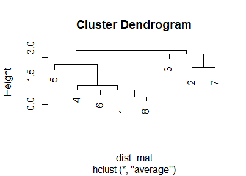
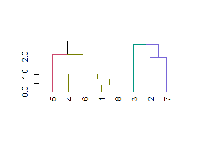

final\_code
================
Rossina Soyan
12/10/2021

-   [Packages for calculating lexical complexity
    measures](#packages-for-calculating-lexical-complexity-measures)
-   [Loading the corpus and tokenization of the
    texts](#loading-the-corpus-and-tokenization-of-the-texts)
-   [Calculating lexical complexity
    measures](#calculating-lexical-complexity-measures)
    -   [Lexical density](#lexical-density)
    -   [Lexial variation](#lexial-variation)
    -   [Lexical sophistication](#lexical-sophistication)
    -   [A dataframe with all lexical complexity
        measures](#a-dataframe-with-all-lexical-complexity-measures)
-   [The cluster analysis](#the-cluster-analysis)
-   [Final notes](#final-notes)
-   [Session info](#session-info)

``` r
##Set knitr options (show both code and output, show output w/o leading #, make figures smaller, hold figures until after chunk)
knitr::opts_chunk$set(echo=TRUE, include=TRUE, comment=NA, fig.height=3, fig.width=4.2, fig.show="hold")
Sys.setlocale("LC_CTYPE", "Russian") #to make sure my text is not gibberish, readable in Rmd
```

    ## [1] "Russian_Russia.1251"

**Note**: The knitted file still shows gibberish texts, but setting the
locale helped me read the texts within R studio.

# Packages for calculating lexical complexity measures

``` r
#install.packages("tidyverse") to be able to use dplyr and tibble
library(tidyverse)
```

    -- Attaching packages --------------------------------------- tidyverse 1.3.1 --

    v ggplot2 3.3.5     v purrr   0.3.4
    v tibble  3.1.4     v dplyr   1.0.7
    v tidyr   1.1.3     v stringr 1.4.0
    v readr   2.0.1     v forcats 0.5.1

    -- Conflicts ------------------------------------------ tidyverse_conflicts() --
    x dplyr::filter() masks stats::filter()
    x dplyr::lag()    masks stats::lag()

``` r
#install.packages('tidytext') to be able to perform tokenization of texts
library(tidytext)
#install.packages("koRpus") to be able to calculate MTLD
#install.koRpus.lang(c("en","ru"))
library(koRpus)
```

    Loading required package: sylly

    For information on available language packages for 'koRpus', run

      available.koRpus.lang()

    and see ?install.koRpus.lang()


    Attaching package: 'koRpus'

    The following object is masked from 'package:readr':

        tokenize

``` r
library(koRpus.lang.ru)
library(koRpus.lang.en)
```

# Loading the corpus and tokenization of the texts

I decided to upload texts written by 8 randomly chosen students. 4 of
them were rated as Intermediate and 4 were rated as Advanced. Each
student submitted 3 texts as part of their placement exam, it means that
the current corpus consists of 24 texts. I followed the instructions for
loading txt files from this [youtube
tutorial](https://www.youtube.com/watch?v=pFinlXYLZ-A).

``` r
#How to load the texts 
folder <- "C:/Users/Rossina/Documents/CMU_student/3_Fall_2021/Statistics_at_Pitt/data" 
filelist_orig <- list.files(path = folder, pattern = ".*.txt")
filelist <- paste(folder, "/", filelist_orig, sep = "")
filelistTexts <- lapply(filelist, FUN = readLines, encoding = "UTF-8", warn = FALSE) #to load the txt files
texts <- lapply(filelistTexts, FUN = paste, collapse = " ") %>% 
  str_remove_all("unclear") #I deleted the word "unclear" from the texts
```

I created a tibble with texts and names. I added the proficiency column
using the instructions from [Winter’s
textbook](https://rstudio-pubs-static.s3.amazonaws.com/116317_e6922e81e72e4e3f83995485ce686c14.html#/9)

``` r
corpus_df <- tibble(text = texts, Student = filelist_orig)
# I need to separate students and their essay ids
corpus_df2 <- corpus_df %>% 
  separate(Student, c("Student", "Entry"))
```

    Warning: Expected 2 pieces. Additional pieces discarded in 24 rows [1, 2, 3, 4,
    5, 6, 7, 8, 9, 10, 11, 12, 13, 14, 15, 16, 17, 18, 19, 20, ...].

``` r
#I need to add their proficiency ratings. 
corpus_df3 <- mutate(corpus_df2, Proficiency = ifelse(grepl("[1-4]", Student), "Intermediate", "Advanced")) #Now I have four columns in the tibble
```

I tokenized my texts.

``` r
corpus_df_tidy <- corpus_df3 %>% 
  mutate(text = gsub(x = text, pattern = "\\-\\s", replacement = "")) %>% #to make sure there are no lonely dashes as tokens
  unnest_tokens(word, text, token = "regex", pattern = "[\\s,\\.\\?!\\(\\)\\:\";]") #to make sure that hyphenated words are counted as one token
head(corpus_df_tidy) #Success! 
```

    # A tibble: 6 x 4
      Student  Entry  Proficiency  word     
      <chr>    <chr>  <chr>        <chr>    
    1 Student1 Entry1 Intermediate ìîÿ      
    2 Student1 Entry1 Intermediate äîðîãàÿ  
    3 Student1 Entry1 Intermediate â        
    4 Student1 Entry1 Intermediate òâî¸ì    
    5 Student1 Entry1 Intermediate ïîñëåäíåì
    6 Student1 Entry1 Intermediate ïèñüìå   

# Calculating lexical complexity measures

I decided to calculate lexical complexity measures for each student, not
for each text since proficiency ratings are given to individual students
based on all the texts they have submitted. An individual essay does not
get a separate proficiency rating.

## Lexical density

I loaded txt files with non-lexical words that I have created on my own.

``` r
#The five txt files
RusConjCoord <- readLines("C:/Users/Rossina/Documents/CMU_student/3_Fall_2021/Statistics_at_Pitt/Complexity-measures-and-proficiency/non_lexical_items_for_lex_density/Russian_conjunctions_COORD.txt", encoding = "UTF-8", warn = FALSE) %>% 
  str_remove_all("<.+>") 
RusPrep <- readLines("C:/Users/Rossina/Documents/CMU_student/3_Fall_2021/Statistics_at_Pitt/Complexity-measures-and-proficiency/non_lexical_items_for_lex_density/Russian_prepositions.txt", encoding = "UTF-8", warn = FALSE) %>% 
  str_remove_all("<.+>") 
RusConjSubord <- readLines("C:/Users/Rossina/Documents/CMU_student/3_Fall_2021/Statistics_at_Pitt/Complexity-measures-and-proficiency/non_lexical_items_for_lex_density/Russian_conjunctions_SUBORD.txt", encoding = "UTF-8", warn = FALSE) %>% 
  str_remove_all("<.+>")
RusInter <- readLines("C:/Users/Rossina/Documents/CMU_student/3_Fall_2021/Statistics_at_Pitt/Complexity-measures-and-proficiency/non_lexical_items_for_lex_density/Russian_interjections.txt", encoding = "UTF-8", warn = FALSE) %>%
  str_remove_all("<.+>")
RusPrtcl <- readLines("C:/Users/Rossina/Documents/CMU_student/3_Fall_2021/Statistics_at_Pitt/Complexity-measures-and-proficiency/non_lexical_items_for_lex_density/Russian_particles.txt", encoding = "UTF-8", warn = FALSE) %>% 
  str_remove_all("<.+>") 
#I need to combine all non-lexical words
AllnonLEX <- c(RusConjCoord, RusPrep, RusConjSubord, RusInter, RusPrtcl) 
AllnonLEX_df <- tibble(word = AllnonLEX) #This column name (word) should be the same as in corpus_df_tidy to make it easier to perform other functions later
head(AllnonLEX_df) #Success! 
```

    # A tibble: 6 x 1
      word       
      <chr>      
    1 ""         
    2 "è"        
    3 "äà"       
    4 "íå òîëüêî"
    5 "íî è"     
    6 "òàêæå"    

And now I can calculate lexical density, that is, calculate the ratio of
lexical words to total words.

``` r
df_LexDens_tog <-corpus_df_tidy %>% 
  group_by(Student) %>% 
  summarize(total_words = n(),
         lexical_words = sum(!word %in% AllnonLEX_df$word),
         lexical_density = lexical_words/total_words)

df_LexDens_tog #Success! 
```

    # A tibble: 8 x 4
      Student  total_words lexical_words lexical_density
      <chr>          <int>         <int>           <dbl>
    1 Student1         876           660           0.753
    2 Student2         453           332           0.733
    3 Student3         293           231           0.788
    4 Student4         479           363           0.758
    5 Student5         642           455           0.709
    6 Student6         606           451           0.744
    7 Student7         676           496           0.734
    8 Student8         829           617           0.744

But there are no clear differences between intermediate and advanced
students. At a cursory glance, intermediate students seem to have higher
lexical density than advanced students which contradicts the hypothesis
that higher lexical density corresponds to higher proficiency.

## Lexial variation

Lexical variation is often measured using the type-token ratio (TTR) but
since the TTR is affected by text length, researchers started using
Measure of Textual Lexical Diversity (MTLD) instead. MTLD was shown to
produce more stable results across texts despite differences in text
length (Kojima & Yamashita, 2014). According to the koRpus package, MTLD
is “the total number of tokens divided by the number of factors” (p. 60)
Factors are based on segments of varying length, minimum 9 tokens. MTLD
is the average of TTRs based on factors counted forward and backward.

``` r
#I am expected to tokenize the texts within the tokenize function of the koRpus package
filelist %>% 
  map(tokenize, fileEncoding = "UTF-8", lang = "ru") %>% 
  map(MTLD) %>% 
  map(attr, "MTLD") %>% 
  head() #Sorry for the long output. I don't know how to make it shorter.
```

    Language: "ru"
    Language: "ru"
    Language: "ru"
    Language: "ru"
    Language: "ru"
    Language: "ru"

    Warning: Text is relatively short (<100 tokens), results are probably not
    reliable!

    Language: "ru"
    Language: "ru"
    Language: "ru"

    Warning: Text is relatively short (<100 tokens), results are probably not
    reliable!

    Language: "ru"
    Language: "ru"
    Language: "ru"
    Language: "ru"
    Language: "ru"
    Language: "ru"

    Warning: Text is relatively short (<100 tokens), results are probably not
    reliable!

    Language: "ru"
    Language: "ru"
    Language: "ru"
    Language: "ru"
    Language: "ru"
    Language: "ru"
    Language: "ru"
    Language: "ru"
    Language: "ru"

    [[1]]
    [[1]]$MTLD
    [1] 175.3629

    [[1]]$all.forw
    [1] NA

    [[1]]$all.back
    [1] NA

    [[1]]$factors
        forw     back 
    1.897344 1.757576 

    [[1]]$lengths
    [[1]]$lengths$forw
    [1] 121 199

    [[1]]$lengths$forw.compl
    [1] 121

    [[1]]$lengths$mean
    [1] 160

    [[1]]$lengths$mean.compl
    [1] 171

    [[1]]$lengths$sd
    [1] 59.11571

    [[1]]$lengths$sd.compl
    [1] 70.71068

    [[1]]$lengths$back
    [1] 221  99

    [[1]]$lengths$back.compl
    [1] 221


    [[2]]
    [[2]]$MTLD
    [1] 210.5521

    [[2]]$all.forw
    [1] NA

    [[2]]$all.back
    [1] NA

    [[2]]$factors
        forw     back 
    1.436508 1.271248 

    [[2]]$lengths
    [[2]]$lengths$forw
    [1] 194  90

    [[2]]$lengths$forw.compl
    [1] 194

    [[2]]$lengths$mean
    [1] 142

    [[2]]$lengths$mean.compl
    [1] 199.5

    [[2]]$lengths$sd
    [1] 66.69833

    [[2]]$lengths$sd.compl
    [1] 7.778175

    [[2]]$lengths$back
    [1] 205  79

    [[2]]$lengths$back.compl
    [1] 205


    [[3]]
    [[3]]$MTLD
    [1] 98.27186

    [[3]]$all.forw
    [1] NA

    [[3]]$all.back
    [1] NA

    [[3]]$factors
        forw     back 
    2.420168 3.649351 

    [[3]]$lengths
    [[3]]$lengths$forw
    [1] 174  95  17

    [[3]]$lengths$forw.compl
    [1] 174  95

    [[3]]$lengths$mean
    [1] 81.71429

    [[3]]$lengths$mean.compl
    [1] 91.2

    [[3]]$lengths$sd
    [1] 56.36404

    [[3]]$lengths$sd.compl
    [1] 59.4239

    [[3]]$lengths$back
    [1]  7 99 81 99

    [[3]]$lengths$back.compl
    [1]  7 99 81


    [[4]]
    [[4]]$MTLD
    [1] 152.5668

    [[4]]$all.forw
    [1] NA

    [[4]]$all.back
    [1] NA

    [[4]]$factors
        forw     back 
    1.639098 1.318878 

    [[4]]$lengths
    [[4]]$lengths$forw
    [1] 128  95

    [[4]]$lengths$forw.compl
    [1] 128

    [[4]]$lengths$mean
    [1] 111.5

    [[4]]$lengths$mean.compl
    [1] 147.5

    [[4]]$lengths$sd
    [1] 47.27579

    [[4]]$lengths$sd.compl
    [1] 27.57716

    [[4]]$lengths$back
    [1] 167  56

    [[4]]$lengths$back.compl
    [1] 167


    [[5]]
    [[5]]$MTLD
    [1] 195.1781

    [[5]]$all.forw
    [1] NA

    [[5]]$all.back
    [1] NA

    [[5]]$factors
         forw      back 
    0.7531584 0.7531584 

    [[5]]$lengths
    [[5]]$lengths$forw
    [1] 147

    [[5]]$lengths$forw.compl
    [1] 0

    [[5]]$lengths$mean
    [1] 147

    [[5]]$lengths$mean.compl
    [1] 0

    [[5]]$lengths$sd
    [1] 0

    [[5]]$lengths$sd.compl
    [1] 0

    [[5]]$lengths$back
    [1] 147

    [[5]]$lengths$back.compl
    [1] 0


    [[6]]
    [[6]]$MTLD
    [1] 65.09479

    [[6]]$all.forw
    [1] NA

    [[6]]$all.back
    [1] NA

    [[6]]$factors
       forw    back 
    1.37594 1.62500 

    [[6]]$lengths
    [[6]]$lengths$forw
    [1] 59 38

    [[6]]$lengths$forw.compl
    [1] 59

    [[6]]$lengths$mean
    [1] 48.5

    [[6]]$lengths$mean.compl
    [1] 58

    [[6]]$lengths$sd
    [1] 11.03026

    [[6]]$lengths$sd.compl
    [1] 1.414214

    [[6]]$lengths$back
    [1] 57 40

    [[6]]$lengths$back.compl
    [1] 57

``` r
#I also don't know how to filter out the word "unclear" and how to create a dataframe with the MTLD numbers. I decided to create an MTLD vector manually.
MTLDs <- c(175.36, 210.55, 98.27, 152.57, 195.18, 65.09, 103.33, 135.09, 107.63, 195.88, 215.79, 126, 130.99, 189.28, 114.34, 132.16, 110.72, 212, 85.26, 116.43, 92.46, 138.16, 185.48, 157.07)
#Now I need to merge the vector with the student names and create a df with 8 rows
corpus_df4 <- corpus_df3 %>% 
  mutate(MTLD = MTLDs)

corpus_with_MTLDs_tog <- corpus_df4 %>% 
  group_by(Student) %>% 
  summarize(MTLD_tog = mean(MTLD))

corpus_with_MTLDs_tog #Success! Again, the lowest MTLD is among the Advanced students, not among the Intermediate students. My original hypotheses are contradicted by empirical data.
```

    # A tibble: 8 x 2
      Student  MTLD_tog
      <chr>       <dbl>
    1 Student1    161. 
    2 Student2    138. 
    3 Student3    115. 
    4 Student4    179. 
    5 Student5    145. 
    6 Student6    152. 
    7 Student7     98.0
    8 Student8    160. 

I can also compare the MTLD results with the TTR results just to see if
the differences between the two measures.

``` r
df_for_TTR_types <- corpus_df_tidy %>% 
    group_by(Student) %>% 
    count(word) %>% 
    summarise(types = n()) 

df_for_TTR_tokens  <- df_LexDens_tog %>% 
  group_by(Student) %>% 
  select(tokens = total_words)
```

    Adding missing grouping variables: `Student`

``` r
TTR_tog <- df_for_TTR_types %>% 
  full_join(df_for_TTR_tokens, by = "Student") %>% 
  mutate(TTR = types/tokens) 

TTR_tog 
```

    # A tibble: 8 x 4
      Student  types tokens   TTR
      <chr>    <int>  <int> <dbl>
    1 Student1   468    876 0.534
    2 Student2   263    453 0.581
    3 Student3   194    293 0.662
    4 Student4   307    479 0.641
    5 Student5   366    642 0.570
    6 Student6   363    606 0.599
    7 Student7   366    676 0.541
    8 Student8   466    829 0.562

The TTR results are vastly different than MLTD results. The student with
the shortest texts showed the highest TTR, which is what usually happens
when text length is not controlled. Two intermediate level students have
higher TTR than advanced level students, as in MTLD results. I think
types are more meaningful for L2 English texts because Russian is more
morphologically rich than English. Maybe lemmas would have been a better
measure of lexical variation than types for L2 Russian texts.

## Lexical sophistication

Lexical sophistication is measured using the average word length. I need
to calculate the length of each word, add everything up and divide by
the number of words in each text.

``` r
AWL_tog <-corpus_df_tidy %>% 
  group_by(Student) %>% 
  summarize(total_words = n(),
         total_word_length = sum(str_length(word)),
         AWL = total_word_length/total_words)
AWL_tog #Success! No clear differences between Intermediate and Advanced students. 
```

    # A tibble: 8 x 4
      Student  total_words total_word_length   AWL
      <chr>          <int>             <int> <dbl>
    1 Student1         876              4334  4.95
    2 Student2         453              2012  4.44
    3 Student3         293              1385  4.73
    4 Student4         479              2418  5.05
    5 Student5         642              3105  4.84
    6 Student6         606              3082  5.09
    7 Student7         676              3185  4.71
    8 Student8         829              4118  4.97

## A dataframe with all lexical complexity measures

I created a dataframe with my students’ names, their proficiency level
and their lexical complexity measures

``` r
df_for_clustering_tog <- corpus_with_MTLDs_tog %>% 
  full_join(df_LexDens_tog) %>% 
  full_join(AWL_tog) 
```

    Joining, by = "Student"

    Joining, by = c("Student", "total_words")

``` r
df_for_clustering_tog #Success!
```

    # A tibble: 8 x 7
      Student  MTLD_tog total_words lexical_words lexical_density total_word_length
      <chr>       <dbl>       <int>         <int>           <dbl>             <int>
    1 Student1    161.          876           660           0.753              4334
    2 Student2    138.          453           332           0.733              2012
    3 Student3    115.          293           231           0.788              1385
    4 Student4    179.          479           363           0.758              2418
    5 Student5    145.          642           455           0.709              3105
    6 Student6    152.          606           451           0.744              3082
    7 Student7     98.0         676           496           0.734              3185
    8 Student8    160.          829           617           0.744              4118
    # ... with 1 more variable: AWL <dbl>

# The cluster analysis

I want to see if lexical density, lexical sophistication, and lexical
variation produce a cluster typical for Intermediate and Advanced
proficiency levels, how lexical complexity measures match the ACTFL
proficiency levels. I want to conduct hierarchical cluster analysis
similar to Jarvis et al. (2003). They had more data points and
linguistic features, but my project is a pilot project on L2 Russian
texts.  
From [datacamp
tutorial](https://www.datacamp.com/community/tutorials/hierarchical-clustering-R):
I need to scale my data points. Then, I can perform hierarchical cluster
analysis. Last, I need to measure the goodness of clusters.

``` r
#I already have my dataframe df_for_clustering_tog
str(df_for_clustering_tog)
```

    tibble [8 x 7] (S3: tbl_df/tbl/data.frame)
     $ Student          : chr [1:8] "Student1" "Student2" "Student3" "Student4" ...
     $ MTLD_tog         : num [1:8] 161 138 115 179 145 ...
     $ total_words      : int [1:8] 876 453 293 479 642 606 676 829
     $ lexical_words    : int [1:8] 660 332 231 363 455 451 496 617
     $ lexical_density  : num [1:8] 0.753 0.733 0.788 0.758 0.709 ...
     $ total_word_length: int [1:8] 4334 2012 1385 2418 3105 3082 3185 4118
     $ AWL              : num [1:8] 4.95 4.44 4.73 5.05 4.84 ...

``` r
summary(df_for_clustering_tog)
```

       Student             MTLD_tog       total_words    lexical_words  
     Length:8           Min.   : 98.05   Min.   :293.0   Min.   :231.0  
     Class :character   1st Qu.:132.05   1st Qu.:472.5   1st Qu.:355.2  
     Mode  :character   Median :148.25   Median :624.0   Median :453.0  
                        Mean   :143.55   Mean   :606.8   Mean   :450.6  
                        3rd Qu.:160.53   3rd Qu.:714.2   3rd Qu.:526.2  
                        Max.   :179.22   Max.   :876.0   Max.   :660.0  
     lexical_density  total_word_length      AWL       
     Min.   :0.7087   Min.   :1385      Min.   :4.442  
     1st Qu.:0.7335   1st Qu.:2316      1st Qu.:4.723  
     Median :0.7442   Median :3094      Median :4.892  
     Mean   :0.7454   Mean   :2955      Mean   :4.846  
     3rd Qu.:0.7545   3rd Qu.:3418      3rd Qu.:4.988  
     Max.   :0.7884   Max.   :4334      Max.   :5.086  

``` r
any(is.na(df_for_clustering_tog)) #I knew my df pretty well but I checked it anyway
```

    [1] FALSE

``` r
#I need proficiency information to check how good the clustering is at the end
Stud_Prof <- tibble(Student = df_for_clustering_tog$Student) %>% 
  mutate(Proficiency = ifelse(grepl("[1-4]", Student), "Intermediate", "Advanced"))
Stud_Prof_label <- Stud_Prof$Proficiency
```

I scaled the numerical values.

``` r
#I need only three columns
df_three_columns <- df_for_clustering_tog %>% 
  select(MTLD_tog, lexical_density, AWL)
df_three_columns
```

    # A tibble: 8 x 3
      MTLD_tog lexical_density   AWL
         <dbl>           <dbl> <dbl>
    1    161.            0.753  4.95
    2    138.            0.733  4.44
    3    115.            0.788  4.73
    4    179.            0.758  5.05
    5    145.            0.709  4.84
    6    152.            0.744  5.09
    7     98.0           0.734  4.71
    8    160.            0.744  4.97

``` r
#Now I am scaling the column values
df_cluster_sc <- as.data.frame(scale(df_three_columns))
summary(df_cluster_sc) #Mean for all the columns is 0 and the SD should be one
```

        MTLD_tog       lexical_density         AWL         
     Min.   :-1.7307   Min.   :-1.59513   Min.   :-1.8922  
     1st Qu.:-0.4374   1st Qu.:-0.51777   1st Qu.:-0.5737  
     Median : 0.1789   Median :-0.05164   Median : 0.2169  
     Mean   : 0.0000   Mean   : 0.00000   Mean   : 0.0000  
     3rd Qu.: 0.6460   3rd Qu.: 0.39494   3rd Qu.: 0.6645  
     Max.   : 1.3572   Max.   : 1.86655   Max.   : 1.1244  

I built the distance matrix. I tried out the average linkage method. The
dendrogram was built via the hierarchical cluster object with the
hclust() function.

``` r
dist_mat <- dist(df_cluster_sc, method = 'euclidean') #Since all the values here are continuous numerical values, I need to use the euclidean distance method
hclust_avg <- hclust(dist_mat, method = 'average')
plot(hclust_avg)
```

<!-- -->

I cut the dendrogram into two clusters using the cutree() function since
I have two proficiency levels, Intermediate and Advanced.

``` r
cut_avg <- cutree(hclust_avg, k = 2)
```

Another illustration which I think is prettier.

``` r
#install.packages('dendextend', dependencies = TRUE)
suppressPackageStartupMessages(library(dendextend))
```

    Warning: package 'dendextend' was built under R version 4.1.2

``` r
avg_dend_obj <- as.dendrogram(hclust_avg)
avg_col_dend <- color_branches(avg_dend_obj, h = 2)
plot(avg_col_dend) #This looks nice
```

<!-- -->

``` r
#The code below will help me count how many observations are in each cluster
texts_df_cl <- mutate(df_three_columns, cluster = cut_avg)
count(texts_df_cl, cluster) #This is an interesting answer. 
```

    # A tibble: 2 x 2
      cluster     n
        <int> <int>
    1       1     5
    2       2     3

``` r
table(texts_df_cl$cluster,Stud_Prof_label) # 5 out of 8 observations were correctly clustered. 
```

       Stud_Prof_label
        Advanced Intermediate
      1        3            2
      2        1            2

Why have Students 3, 2, and 7 been chosen for one cluster? The review of
raw numbers shows that they have the lowest MTLD and AWL numbers.
Lexical density was not considered in this clustering.

# Final notes

``` r
Sys.setlocale("LC_CTYPE", "English") # to make sure that nothing changes how my other files are read
```

    [1] "English_United States.1252"

# Session info

``` r
sessionInfo()
```

    R version 4.1.1 (2021-08-10)
    Platform: x86_64-w64-mingw32/x64 (64-bit)
    Running under: Windows 10 x64 (build 19043)

    Matrix products: default

    locale:
    [1] LC_COLLATE=English_United States.1252 
    [2] LC_CTYPE=English_United States.1252   
    [3] LC_MONETARY=English_United States.1252
    [4] LC_NUMERIC=C                          
    [5] LC_TIME=English_United States.1252    

    attached base packages:
    [1] stats     graphics  grDevices utils     datasets  methods   base     

    other attached packages:
     [1] dendextend_1.15.2    koRpus.lang.en_0.1-4 koRpus.lang.ru_0.1-2
     [4] koRpus_0.13-8        sylly_0.1-6          tidytext_0.3.2      
     [7] forcats_0.5.1        stringr_1.4.0        dplyr_1.0.7         
    [10] purrr_0.3.4          readr_2.0.1          tidyr_1.1.3         
    [13] tibble_3.1.4         ggplot2_3.3.5        tidyverse_1.3.1     

    loaded via a namespace (and not attached):
     [1] Rcpp_1.0.7        lubridate_1.7.10  lattice_0.20-44   assertthat_0.2.1 
     [5] digest_0.6.27     utf8_1.2.2        R6_2.5.1          cellranger_1.1.0 
     [9] backports_1.2.1   reprex_2.0.1      evaluate_0.14     highr_0.9        
    [13] httr_1.4.2        pillar_1.6.2      rlang_0.4.11      readxl_1.3.1     
    [17] data.table_1.14.0 rstudioapi_0.13   Matrix_1.3-4      rmarkdown_2.10   
    [21] sylly.en_0.1-3    munsell_0.5.0     broom_0.7.9       compiler_4.1.1   
    [25] janeaustenr_0.1.5 modelr_0.1.8      xfun_0.25         pkgconfig_2.0.3  
    [29] htmltools_0.5.2   tidyselect_1.1.1  gridExtra_2.3     viridisLite_0.4.0
    [33] fansi_0.5.0       crayon_1.4.1      tzdb_0.1.2        dbplyr_2.1.1     
    [37] withr_2.4.2       SnowballC_0.7.0   grid_4.1.1        jsonlite_1.7.2   
    [41] gtable_0.3.0      lifecycle_1.0.0   DBI_1.1.1         magrittr_2.0.1   
    [45] scales_1.1.1      tokenizers_0.2.1  cli_3.0.1         stringi_1.7.4    
    [49] viridis_0.6.2     fs_1.5.0          xml2_1.3.2        ellipsis_0.3.2   
    [53] generics_0.1.0    vctrs_0.3.8       tools_4.1.1       glue_1.4.2       
    [57] hms_1.1.0         fastmap_1.1.0     yaml_2.2.1        sylly.ru_0.1-2   
    [61] colorspace_2.0-2  rvest_1.0.1       knitr_1.33        haven_2.4.3      
